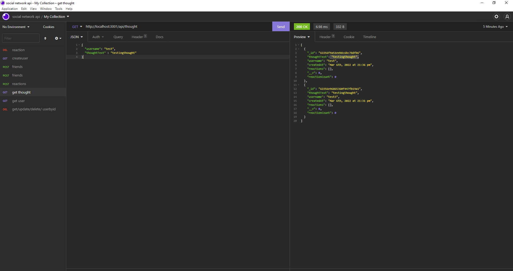

# apex-social-network

Apex Social Network

# Table of Contents

---

[Description](#Description)

[Installations](#Installations)

[Test](#Test)

[Video](#Video)

[Questions](#Questions)

# Description

Project designed to allow users to create, read, update and delete - users, thoughts and reactions. To mimic what a social network
might have as its functionality. Although, no front end engagement implemented. CRUD elements only visible through insomnia or like 
programs. 

# Installation

   mongoose, express. 

# Test

    npm install, npm start

# Video

chrome-extension://mmeijimgabbpbgpdklnllpncmdofkcpn/app.html#/files/0128b746-a82f-47cb-y27e-69219a26d520

# Questions

---

## Contact me here:

## Author

     Roberto Gasparin

## [Github](https://github.com/box-monkey)

## [Email](mailto:jr.gasparin15@gmail.com)

#

